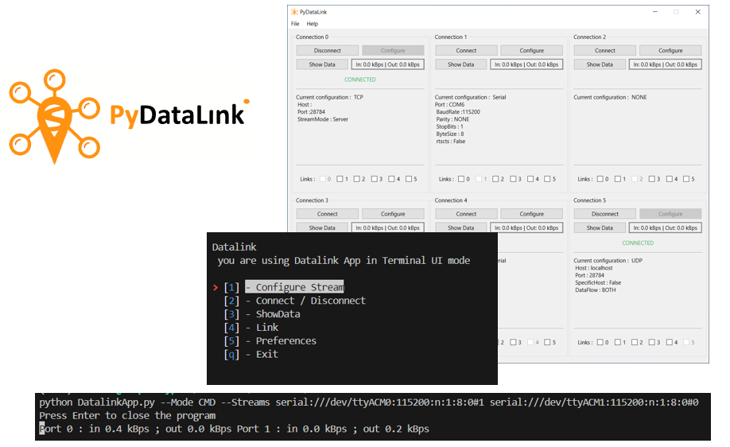
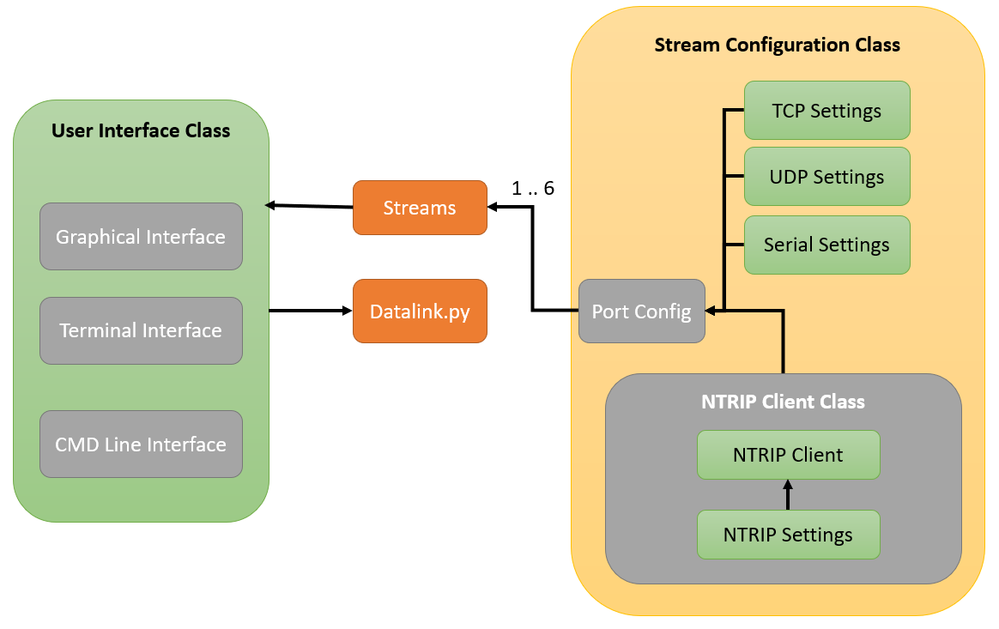
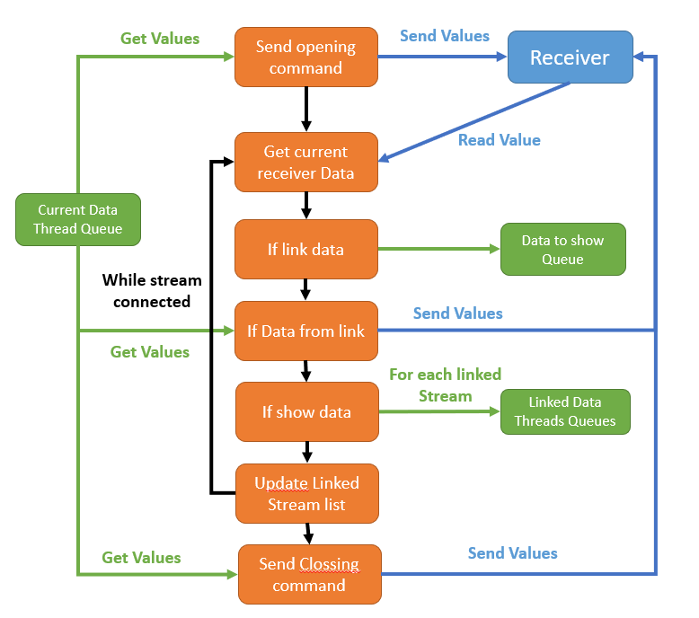

<div align="center">

# Developer Guide for pyDatalink 
## AUTHORS
  
| Name | GitHub |
|------|--------|
| Arno Balois| <a href="https://github.com/Arno-Balois">Arno-Balois</a> </br> | 

## MAINTAINER
  
| GitHub |
|--------|
| <a href="https://github.com/septentrio-users">septentrio-users</a> </br> |    

## DO YOU HAVE ANY QUESTIONS? CONTACT SEPTENTRIO SUPPORT TEAM

| <a href="https://web.septentrio.com/GH-SSN-support ">Septentrio Support Page</a>|
|---|

## SEPTENTRIO LINKS FOR USERS
 
| Contact                                                                          | Septentrio Home Page                                                        |
|----------------------------------------------------------------------------------|-----------------------------------------------------------------------------|
| <a href="https://web.septentrio.com/GH-SSN-contact ">Septentrio Contact Page</a> | <a href="https://web.septentrio.com/UBL-SSN-home">Septentrio Home Page</a> |


</div>

## TABLE OF CONTENTS
* [Is the project Open Source?](#is-this-project-open-source)
* [What is pyDatalink ?](#what-is-pydatalink)
* [How it works](#how-it-work)
* [Getting Started](#Getting-Started)
* [User Guide](#user-guide)

# Is this project Open Source
yes , The very purpose of this project is to remake a version of pydatalink with a source code accessible to everyone because the source code of the RxTools pydatalink is not available for proprietary reasons.
# What is pyDatalink

<div align="center">

</div>

<br>

pyDatalink is a debugging software that allows you to view all the data passing through a connection. The current version of pydatalink is still available, as part of the RxTools software package, but this version is only available for machines with x86 processors.
In its current version pydatalink allows a user to configure a connection (TCP, Serial, UDP or NTRIP) and then launch the connection. When the connection is established without error, it is possible to view the data in transit.
pyDatalink is used for debugging but also in more specific cases to have access to a correction service for several connections. This makes it possible to have a connection dedicated to communication with an NTRIP server and then to transmit the corrections to several receivers at the same time. 
# Comparaison with RxTools pyDatalink
As mentioned above, pyDatalink is an software available in the RxTools package. Furthermore, pydatalink is only available for x86 processors. 

- The major difference with the new version of pydatalink (PyDatalink) is the compatibility with x86 and ARM processors. This compatibility is possible because pyDatalink has been completely developed in python. 

- Compared with the previous version, pyDatalink integrates several interfaces, making it compatible with many different uses.

- The code is also completely different, in fact the Rxtools version of pydatalink is not open source for proprietary code reasons. pyDatalink is entirely open-source which means that the code can be used by the community without restriction.

- Finally, the interface and logic parts are completely separate, which means that the code can be reused in other projects if necessary, and also makes it easier to understand during maintenance operations. 
# Code structure
The software has been developed so that each class can be used separately. 

<div align="center">

</div>

<br>


# How it work
## Startup Configuration
When the pyDatalink is launched, if no specific configuration has been given as a parameter, the software will look for the previous configuration in a specific directory. If this directory does not exist and/or the file does not exist, these will be created and the configuration will be the default config. Note that : the configuration is only saved when the pydatalink is closed.

During configuration, each item of data is checked, and if the data is incorect, the default value is used.

Configuration with a config file is not performed when the pydatalink is in command line mode.
## Stream Thread

Each time a Stream is started, the connection is initialised to detect any errors made during configuration. Then, when the connection is correctly opened, a thread is launched. This thread manages the important parts of the communication :
- sending launch instructions, if any 
- read the data available on the connection 
- insert it into the user display queue if enabled 
- send the data to the other connection 
- read the data sent to it by the other connection
- update the list of connections to which data has been sent 
- if the connection is closed, send the closing data 

<br>

<div align="center">

</div>


## Terminal Interface 

A semi-graphical interface in a terminal is available. This was created using the **Simple-term-menu** library. 
Simple Term Menu is an open-source pytgon package that allows you to create interactive menus in a terminal.

<div align="center">


<br>

| <a href="https://github.com/IngoMeyer441/simple-term-menu/tree/develop">Learn more about the simple-term-menu package</a> |
|---|

</div>

## Graphical Interface
<div align="center">


</div>

For the graphical interface, the Pyside6 graphics package is used.
PySide is the Python Qt bindings project, providing access the complete Qt 4.8 framework.

The PySide project is developed in the open, with all facilities you’d expect from any modern OSS project such as all code in a git repository, an open Bugzilla for reporting bugs, and an open design process.
<div align="center">

| <a href="http://pyside.github.io/docs/pyside/">Learn more about the PySide package</a> |
|---|

</div>

## SUGGESTIONS FOR IMPROVEMENTS

There are several possible enhancements to the code that is available today. Therefore, from septentrio we want to warn about some features of the code that can be improved and at the same time invite users willing to help or with ideas for improvement to share those ideas or feedback here on GitHub or through the septentrio support page.

These are some of the points to improve or features to add:

- Create Exectuble with PyInstaller
- Add Support for virtual serial port


# Getting Started

As pyDatalink app is entirely developed with python, you must first install python and all its dependencies.
## Install Python 
### Unix Users

1 - Update Package index
```
sudo apt update 
```
2 - Install Python
```
sudo apt-get install python3 pip
```
### Windows Users
Download the latest version of the Python executable installer for Windows from the <a href="https://www.python.org/downloads/"> the official Python downloads page </a>.

Or open the windows store and search for python and click on install


## Install project

Once you've installed python, all you have to do is download the source code and launch the application. 

### Using git clone
```
git clone https://github.com/septentrio-gnss/DataLink.git
cd DataLink
```
### using GitHub
 - First click on **code**.<br>
 - Then click on **dowload Zip**
### (Optional) Create a Virtual environement
This will allow you to create a contained workspace where every python package will be installed
```
python -m venv venv
source venv/bin/activate
```
### Install Python packages 
```
pip install -r requirements.txt
```
### Run pyDatalink 

By default pyDatalink run as a Graphical interface
```
python pyDatalinkApp.py
```

# User Manual

The purpose of the user manual is to explain how to install the application, how to use it and also to present the various functionnalities. 

<div align="center">

| <a href="https://github.com/septentrio-gnss/Septentrio-PyDataLink/tree/main/user">Go to User Manual</a> |
|---|

</div>


