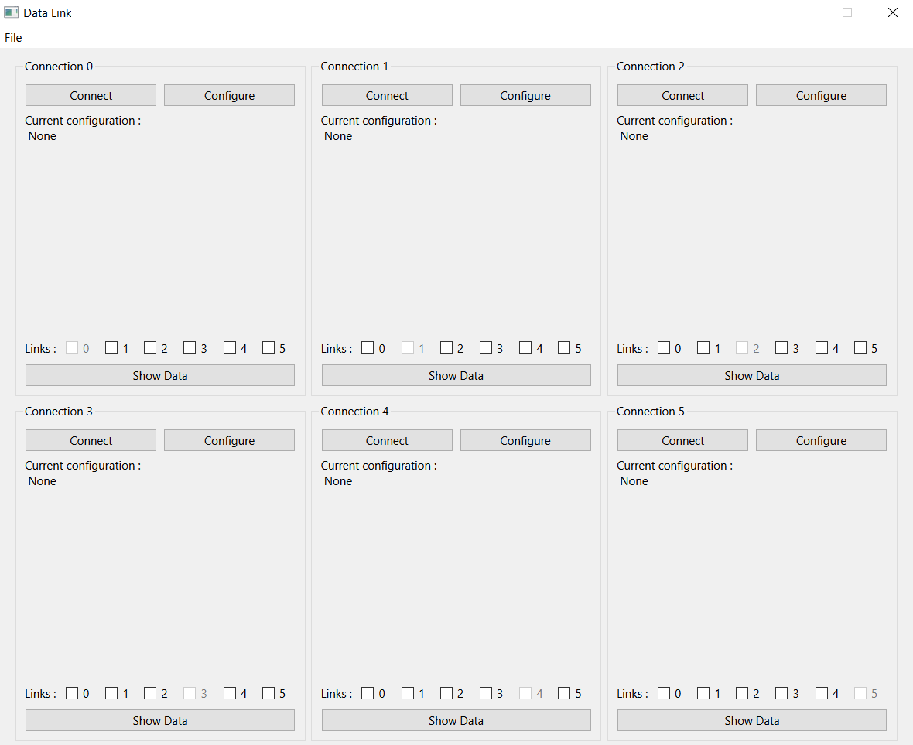
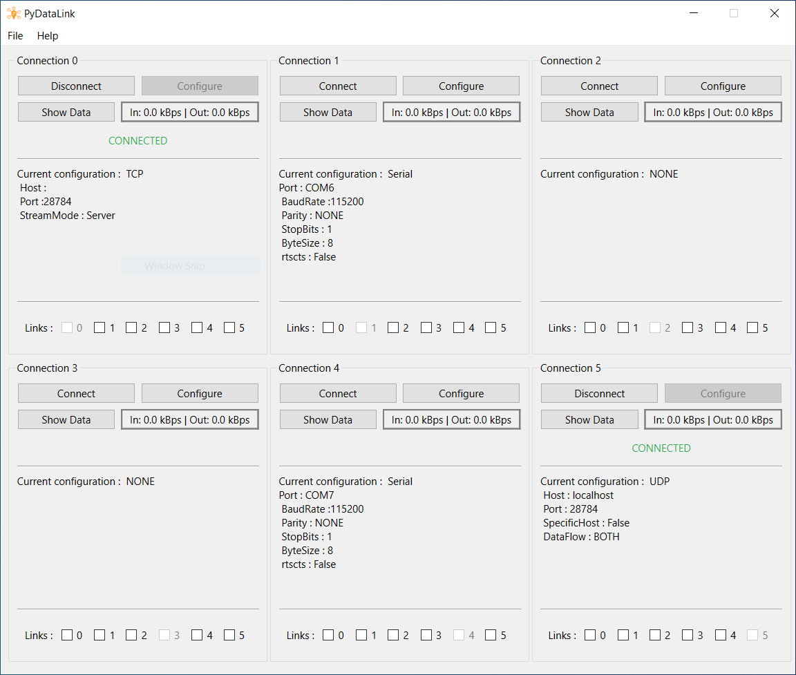
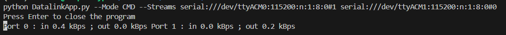
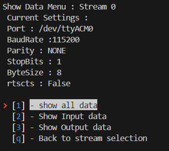

<div align="center">

# User Manual for pyDatalink 
## AUTHORS
  
| Name | GitHub |
|------|--------|
| Arno Balois| <a href="https://github.com/Arno-Balois">Arno-Balois</a> </br> | 

## MAINTAINER
  
| GitHub |
|--------|
| <a href="https://github.com/septentrio-users">septentrio-users</a> </br> |    

## DO YOU HAVE ANY QUESTIONS? CONTACT SEPTENTRIO SUPPORT TEAM

| <a href="https://web.septentrio.com/GH-SSN-support ">Septentrio Support Page</a>|
|---|

## SEPTENTRIO LINKS FOR USERS
 
| Contact                                                                          | Septentrio Home Page                                                        |
|----------------------------------------------------------------------------------|-----------------------------------------------------------------------------|
| <a href="https://web.septentrio.com/GH-SSN-contact ">Septentrio Contact Page</a> | <a href="https://web.septentrio.com/UBL-SSN-home">Septentrio Home Page</a> |


</div>

## TABLE OF CONTENTS
* [What is this guide about](#what-is-this-guide-about)
* [Installation](#installation)
* [Getting Started]()
    * [Graphical Interface](#graphical-interface)
    * [Command Line](#command-line-interface)
    * [Terminal Interface](#terminal-interface)
* [Other Parameter](#other-parameter)
* [Use Case scenario](#)
# What is this guide about
This guide explains how to use pyDatalink software. It comes with 3 types of interface:
- Graphical Interface
- Command Line
- Terminal Interface

These interfaces are used to configure connections, launch them and, if necessary, link them together. 
<div align="center">

</div>
# Installation
As pyDatalink app is entirely developed with python, you must first install python and all its dependencies.
## Install Python 
### Unix Users

1 - Update Package index
```
sudo apt update 
```
2 - Install Python
```
sudo apt-get install python3 pip
```
### Windows Users
Download the latest version of the Python executable installer for Windows from the <a href="https://www.python.org/downloads/"> the official Python downloads page </a>.

Or open the windows store and search for python and click on install


## Install project

Once you've installed python, all you have to do is download the source code and run the application. 

### Using git clone
```
git clone https://github.com/septentrio-gnss/Septentrio-PyDataLink.git
cd Septentrio-PyDataLink
```
### Using GitHub
 - First click on **code**.<br>
 - Then click on **dowload Zip**
### (Optional) Create a Virtual environement
This will allow you to create a contained workspace where every python package will be installed
```
python -m venv venv
source venv/bin/activate
```
### Install Python packages 
```
pip install -r requirements.txt
```
# Graphical Interface
<div align="center">

</div>
<br>
The graphical interface is the interface that allows you to perform the most tasks. It gives you access to the full range of pydatalink functions.

## Available Functionality 
- Configuring a connection: TCP , UDP , NTRIP , Serial
- Log data passing through the connection 
- Send commands on connection and/or disconnection 
- Display data in transit on connections (View more than 1 connections)
- Send commands 
- Redirect data to another connection
- View the amount of data in transit in real time

## How to use it 

Use the following command to use pyDatalink in Graphical Interface mode 

```
python pyDatalink.py -m GUI
```
or 
```
python pyDatalink.py
```
# Command Line Interface
<div align="center">

</div>
The command line interface allows you to launch a precise configuration. The configuration of connections and links is done in a single command line.

## Available Functionality 
- Configure a connection: TCP , UDP , NTRIP , Serial
- Display data in transit on a single connection
- Redirect data to another connection
- View the amount of data in transit on each connection in real time

## How to use it 
To be able to configure from the command line, you must comply with the following instructions

#### Serial 
```
serial://[Port]:[Baudrate]:[parity]:[StopBit]:[bsize]:[FCTR]#[linkport]
``` 
The details of the different values for the configuration for serial connection are available further down in the document.  : [Serial Settings](#serial-settings)
#### TCP Client
```
tcpcli://[addr]:[port]#[linkport]
```
The details of the different values for the configuration for client tcp connection are available further down in the document. : [TCP Settings](#tcp-settings)
#### TCP Server
``` 
tcpsvr://[port]#[linkport]
```
The details of the different values for the configuration for server tcp connection are available further down in the document  : [TCP Settings](#tcp-settings)
#### UDP
``` 
UDP://[port]#[linkport]
```
The details of the different values for the configuration for udp connection are available further down in the document : [UDP Settings](#udp-settings)
#### UDP with Specific hostname
```
UDPSPE://[addr]:[port]#[linkport]
```
The details of the different values for the configuration for udp connection with a specific hostname are available further down in the document  : [UDP Settings](#udp-settings)
#### NTRIP Client
```
ntrip://[user]:[pwd]@[adrr]:[port]/[mountpoint]#[linkport]
```
The details of the different values for the configuration for a NTRIP connection are available further down in the document : [NTRIP Settings](#ntrip-settings)
### Example
In this exemple we create 2 serial stream that are inter connected 
#### Unix
```
python pyDatalink.py --Mode CMD --Streams serial:///dev/ttyACM0:115200:n:1:8:0#1 serial:///dev/ttyACM1:115200:n:1:8:0#0 
```

#### Windows
```
python pyDatalink.py --Mode CMD --Streams serial://COM7:115200:n:1:8:0#1 serial://COM6:115200:n:1:8:0#0 
```

# Terminal Interface
<div align="center">

</div>
<br>
The project propose a menu-based TUI, providing a semi-graphical way to configure and use the app . To navigate through the menus, you can either use the arrow keys to select an option and press `enter`, or use the corresponding number key next to the menu item. Pressing the `q` key will always take you back or allow you to quit the application.

To start the Data link in TUI mode
```
python pyDatalink.py -m TUI
```

On this menu you can find the following items :

* [Configuration](#Configure)
* [connect / disconnect](#connect-disconnect)
* [ShowData](#Show-Data)
* [Link](#Link)
* [Preferences](#Preferences)


## Configure

The Configure menu allow you to choose the type of communication you want to use and configure it. The available communication types are `Serial`, `TCP`, `UDP`, and `NTRIP`.

### Serial Settings
| Parameter | Possible Values | Default Value | Description |
|:-----------:|:-----------------:|:---------------:|:-------------:|
| Port      | /dev/ttyACM0    | -             | The COM port to be used for the connection |
| Baudrate  | 300, 600, 1200, 2400, ... | **115200** | The baud rate for the serial connection |
| StopBits  | 1 bit, 1.5 bits, or 2 bits | **1 bit** | The number of stop bits for the serial connection |
| Parity    | None, Even, ODD, Mark, Space | **None** | The parity setting for the serial connection |
| Bytesize  | 5 bits, 6 bits, 7 bits, or 8 bits | **8 bits** | The number of data bits for the serial connection |
| Rtc-Cts   | true or false | **False** | Enable or disable RTS/CTS flow control for the serial connection |

### TCP Settings
| Parameter | Possible Values | Default Value | Description |
|:-----------:|:-----------------:|:---------------:|:-------------:|
| Host      | Any IPv4 address | 127.0.0.1     | The IP address of the TCP server |
| Port      | Any available port | 28784 | The port number for the TCP connection |
| Connection Mode | Client or Server | Client | The mode of the TCP connection |

### UDP Settings
| Parameter | Possible Values | Default Value | Description |
|:-----------:|:-----------------:|:---------------:|:-------------:|
| Specific Host      | Any IPv4 address | 127.0.0.1     | The IP address of the UDP specific Host |
| Port      | Any available port | 28784 | The port number for the UDP connection |
| Specific Host | true or false | True | If the UDP connection as to send/receive data from a specific Host |
| Data Flow | Transmit , Listen , Both | Both | |

### NTRIP Settings
| Parameter | Possible Values | Default Value | Description |
|:-----------:|:-----------------:|:---------------:|:-------------:|
| User | any User Name |- | username used for the authentification with the ntrip server |
| Password | Any Password | - | Password used for the authentification with the ntrip server |
| Hostname      | Any hostname given by a ntrip service provider | -   | The Hostname of the ntrip service provider |
| Port      | Any available port | - | The port number of the ntrip service provider |
| MountPoint | *Contact your ntrip service provider* | - | Mountpoint of the ntrip server , depend on the provider |
|

## connect disconnect

In this section, you can start or stop a connection. To connect or disconnect, simply select a connection then select with type of stream oyu want to use and press `enter`. If the connection fails, a message will be displayed above the menu indicating the issue that needs to be fixed before retrying. If the connection is successful, the status next to the connection name will switch between "Connected" and "Disconnected".

## Show Data
The Show Data functionality allows you to view data that passes through a connection. You have multiple options for viewing data: `Input`, `Output`, or `All`.

<div align="center">

</div>

Once you have chosen an option, the data will be displayed on the terminal. To return to the menu, simply press `enter`.

## Link ##

<div align="center">

</div>

Link is a tool that allows you to connect one or multiple connections together. Only the inconming data will be forwarded to the linked connections. To link a connection, select a connection and then select all the connections you want to link.

## Preferences 

This menu allows you to change some parameters of the app. This parameter can range from `2` to `6` connections. We have restricted this parameter to avoid any performance issues.
| Parameter | Possible Values | Default Value | Description |
|:-----------:|:-----------------:|:---------------:|:-------------:|
| Number of stream | from 1 to 6 | **6**  | Number of stream that you can configure |
| Password | Any Password | - | Password used for the authentification with the ntrip server |
| Hostname      | Any hostname given by a ntrip service provider | -   | The Hostname of the ntrip service provider |
| Port      | Any available port | - | The port number of the ntrip service provider |
| MountPoint | *Contact your ntrip service provider* | - | Mountpoint of the ntrip server , depend on the provider |
|


# Other Parameter
pyDatalink comes with configuration parameters that alow you to run the app with a different interface , or use a Config file other than the default one. The other Two parameter are needed when using the pydatalink in Command Line Mode


<div align="center">

|  **Name / Label** |   **Definition**   |  **Default Values**  | **Possible Values** |               **Example**              | **Required** |
|:-----------------:|:------------------:|:--------------------:|:-------------------:|:--------------------------------------:|:------------:|
|     Mode , m     | Select User Interface Type | **GUI**             | TUI , GUI or CMD               | --Mode TUI / -m TUI                   |    **NO**   |
|  ConfigPath , c  | Config file path           |  **Default Config** |         any valid path         | --ConfigPath C:\Documents\Config.conf |    **NO**    |
| Streams , s | Parameter use for **CMD** Mode  |       **none**       |  see [Command Line Interface](#command-line-interface) | - |    **NO**    |
| ShowStream | Show data of a stream , use in **CMD** Mode| **none**| number between **1** and **6** | see [Command Line Interface](#command-line-interface) | **NO**|

</div>

# Developper Manual
The purpose of the development manual is to explain how the code is structured, how the programme works and how it was made. This manual is mainly intended for people who want to keep the programme up to date. 

<div align="center">

| <a href="https://github.com/septentrio-gnss/Septentrio-PyDataLink/tree/main/dev">Go to Developper Manual</a> |
|---|

</div>